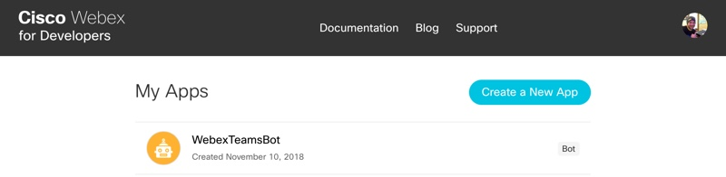
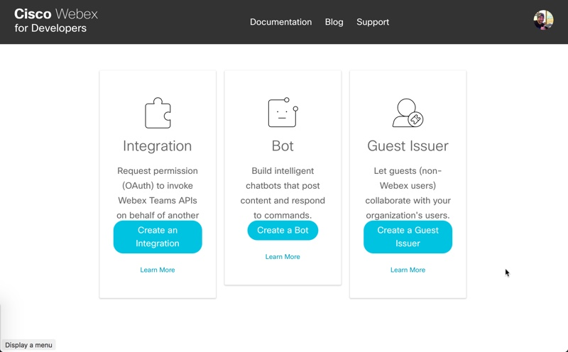
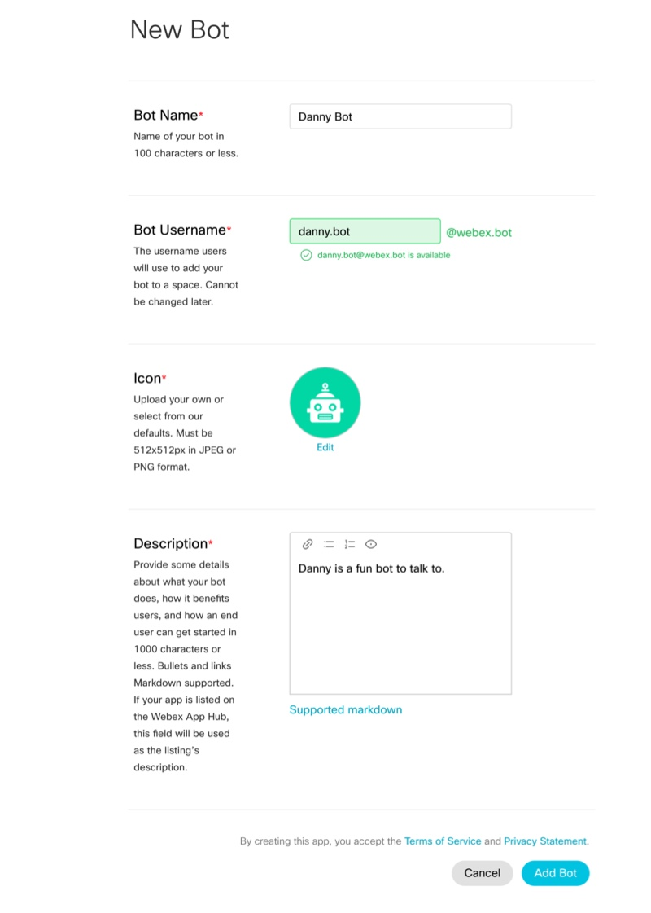
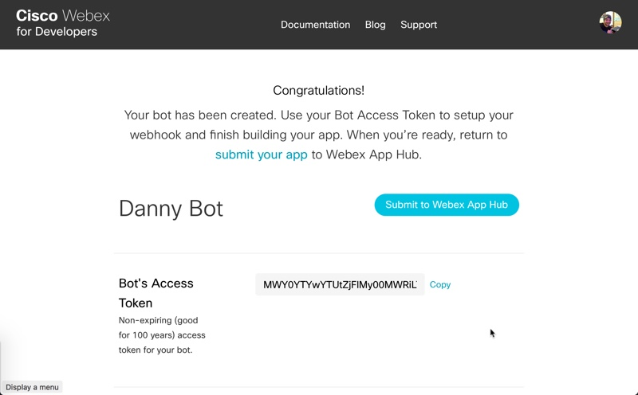

# webexteamsbot
This package makes creating [Webex Teams](https://www.webex.com/products/teams/index.html) bots in Python super simple.  

> This package is based on the previous [ciscosparkbot](https://github.com/imapex/ciscosparkbot) project.  This version will both move to new Webex Teams branding as well as add new functionality.  If you've used `ciscosparkbot` you will find this package very similar and familiar.  

# Prerequisites 

If you don't already have a [Webex Teams](https://www.webex.com/products/teams/index.html) account, go ahead and [register](https://www.webex.com/pricing/free-trial.html) for one.  They are free.

1. You'll need to start by adding your bot to the Webex Teams website.

    [https://developer.webex.com/my-apps](https://developer.webex.com/my-apps)

1. Click **Create a New App**

    

1. Click **Create a Bot**.

    

2. Fill out all the details about your bot.  You'll need to set a name, username, icon (either upload one or choose a sample), and provide a description.

    

3. Click **Add Bot**.

1. On the Congratulations screen, make sure to copy the *Bot's Access Token*, you will need this in a second.

    

# Installation

> Python 3.6+ is recommended.  Python 2.7 should also work.  

1. Create a virtualenv and install the module

    ```
    python3.6 -m venv venv
    source venv/bin/activate
    pip install webexteamsbot
    ```

# Usage

1. The easiest way to use this module is to set a few environment variables

    > Note: See [ngrok](#ngrok) for details on setting up an easy HTTP tunnel for development.

    ```
    export TEAMS_BOT_URL=https://mypublicsite.io
    export TEAMS_BOT_TOKEN=<your bots token>
    export TEAMS_BOT_EMAIL=<your bots email>
    export TEAMS_BOT_APP_NAME=<your bots name>
    ```

1. A [sample script](sample.py) is also provided for your convenience
    
    ```
    # -*- coding: utf-8 -*-
    """
    Sample code for using webexteamsbot
    """
    
    import os
    from webexteamsbot import TeamsBot
    from webexteamsbot.models import Response
    
    # Retrieve required details from environment variables
    bot_email = os.getenv("TEAMS_BOT_EMAIL")
    teams_token = os.getenv("TEAMS_BOT_TOKEN")
    bot_url = os.getenv("TEAMS_BOT_URL")
    bot_app_name = os.getenv("TEAMS_BOT_APP_NAME")
    
    
    def do_something(incoming_msg):
        """
        Sample function to do some action.
        :param incoming_msg: The incoming message object from Teams
        :return: A text or markdown based reply
        """
        return "i did what you said - {}".format(incoming_msg.text)
    
    
    def ret_message(incoming_msg):
        m = Response()
        u = "https://sayingimages.com/wp-content/uploads/"
        u = u + "aaaaaalll-righty-then-alrighty-meme.jpg"
        m.files = u
        return m
    
    
    # Create a new bot
    bot = TeamsBot(
        bot_app_name,
        teams_bot_token=teams_token,
        teams_bot_url=bot_url,
        teams_bot_email=bot_email,
        debug=True,
    )
    
    
    # Add new command
    bot.add_command("/dosomething", "help for do something", do_something)
    bot.add_command(
        "/demo",
        "sample that allows Webex Teams message to be returned",
        ret_message,
    )
    
    # Run Bot
    bot.run(host="0.0.0.0", port=5000)
    ```

# ngrok

[ngrok](http://ngrok.com) will make easy for you to develop your code with a live bot.

You can find installation instructions here: [https://ngrok.com/download](https://ngrok.com/download)

1. After you've installed `ngrok`, in another window start the service

    ```
    ngrok http 5000
    ```

1. You should see a screen that looks like this:

    ```
    ngrok by @inconshreveable                                                                                                                                 (Ctrl+C to quit)
    
    Session Status                online
    Version                       2.2.4
    Region                        United States (us)
    Web Interface                 http://127.0.0.1:4040
    Forwarding                    http://this.is.the.url.you.need -> localhost:5000
    Forwarding                    https://this.is.the.url.you.need -> localhost:5000
    
    Connections                   ttl     opn     rt1     rt5     p50     p90
                                  2       0       0.00    0.00    0.77    1.16
    
    HTTP Requests
    -------------
    
    POST /                         200 OK
    ```

1. Make sure and update your environment with this url:

    ```
    export TEAMS_BOT_URL=https://this.is.the.url.you.need
    
    ```

1. Now launch your bot!!

    ```
    python sample.py
    ```

## Local Development

If you have an idea for a feature you would like to see, we gladly accept pull requests.  To get started developing, simply run the following..

```
git clone https://github.com/hpreston/webexteamsbot
cd webexteamsbot
pip install -r requirements_dev.txt
python setup.py develop
```

### Linting

We use flake 8 to lint our code. Please keep the repository clean by running:

```
flake8
```

<!--### Testing

Tests are located in the [tests](./tests) directory.

To run the tests in the `tests` folder, you can run the following command
from the project root.

```
coverage run --source=ciscosparkbot setup.py test
coverage html
```

This will generate a code coverage report in a directory called `htmlcov`-->

# Credits
This package was created with
[Cookiecutter](https://github.com/audreyr/cookiecutter) and the
[audreyr/cookiecutter-pypackage](https://github.com/audreyr/cookiecutter-pypackage)
project template.
